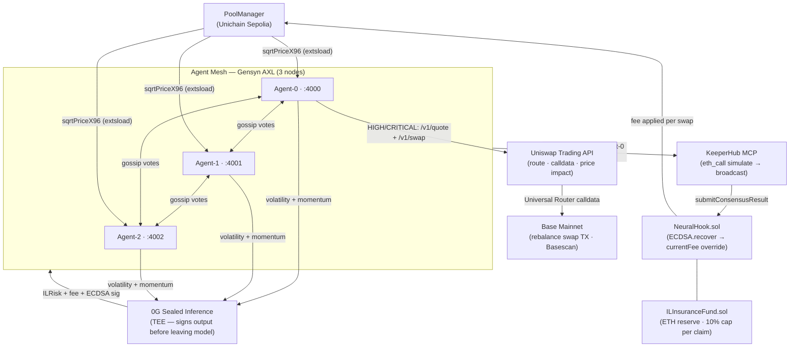

# 🧠 NeuralHook

**AI-powered impermanent loss protection for Uniswap v4 LPs — live on Unichain Sepolia.**

NeuralHook is a Uniswap v4 hook that uses a three-node AI agent network to predict impermanent loss risk before it happens. When risk rises, the pool fee surges automatically to compensate LPs. Every fee change is cryptographically signed by the inference layer and verified atomically on-chain — the AI cannot hallucinate a fee. When risk reaches HIGH or CRITICAL, agents call the Uniswap Trading API to get the optimal route, then autonomously execute a protective WETH → USDC rebalance swap on Base — closing the full protect → rebalance loop without human intervention.

🎥 **[Watch the demo](https://youtu.be/rY4npbPU5bQ?si=KO4Gj0y8LV0OzR7H)** · 🏆 **[ETHGlobal Showcase](https://ethglobal.com/showcase/neuralhook-8gxzp)**

---

## 🚀 Contracts

| Contract                     | Address                                      | Network          |
| ---------------------------- | -------------------------------------------- | ---------------- |
| **NeuralHook**               | `0x6DCb771F0A8A61F2679989453af9549C9ceA89c0` | Unichain Sepolia |
| **ILInsuranceFund**          | `0x4D575ac6C3df76C7E22EB59715F0a9e839f16811` | Unichain Sepolia |
| **PoolManager (Uniswap v4)** | `0x00B036B58a818B1BC34d502D3fE730Db729e62AC` | Unichain Sepolia |

**Pool:** ETH / USDC · DYNAMIC_FEE_FLAG · tickSpacing 60
**Chain ID:** 1301
**Explorer:** https://sepolia.uniscan.xyz

### Agent Wallet (swap execution)

| Role | Address | Network |
| ---- | ------- | ------- |
| **Agent-0 executor** | `0xa8bcD8ca1561C3F4716490157B74Aa7FfFB9b58C` | Base mainnet |

Agent-0 autonomously submits `submitConsensusResult` on Unichain Sepolia and executes WETH → USDC rebalance swaps on Base mainnet via the Uniswap Trading API. Verify swap activity: [Basescan](https://basescan.org/address/0xa8bcD8ca1561C3F4716490157B74Aa7FfFB9b58C)

---

## 🏗️ Architecture



Six layers — remove any one and the system stops working.

---

## ⚙️ How It Works

## 1️⃣ Smart Contracts

`NeuralHook.sol` registers four Uniswap v4 hook callbacks:

* `beforeSwap`
* `afterSwap`
* `beforeAddLiquidity`
* `afterRemoveLiquidity`

Dynamic fees are enabled via:

`DYNAMIC_FEE_FLAG (0x800000)`

On every swap, `beforeSwap` reads `currentFee` (set by the last oracle submission) and overrides the pool fee atomically.

No governance tx. No delay.

On every `submitConsensusResult` call, the contract:

1. Checks `block.timestamp <= timestamp + MAX_STALENESS (600s)`
2. Calls `ECDSA.recover(ethSignedHash, signature)`
   Reverts if signer ≠ `trustedOracle`
3. Updates:

   * `currentFee`
   * `currentRisk`
   * `lastUpdateTimestamp`
4. Emits `InferenceUpdated`

🛡️ `ILInsuranceFund.sol` holds ETH reserves.

LPs whose IL exceeds **20 bps** can claim.
Each claim is capped at **10% of reserves**.

Pool state is read live via `StateLibrary.extsload` — the same pattern used by the Uniswap v4 periphery.

---

## 2️⃣ AI Inference (0G Sealed Inference)

Each agent runs a **30-second inference loop**:

* Reads live `sqrtPriceX96` from PoolManager via `extsload`
* Computes:

  * rolling 30-period volatility σ
  * tick proximity
  * 5-period momentum
* Calls 0G Sealed Inference (TEE) or local heuristic fallback
* Agent snapshots and inference history are persisted to **0G Storage**
* Outputs:

```text
ILRisk
recommendedFee
rebalanceSignal
yieldScore
```

Signs result:

```solidity
solidityPackedKeccak256([
  resultHash,
  ilRisk,
  predictedILBps,
  recommendedFee,
  rebalanceSignal,
  yieldScore,
  timestamp,
  chainId,
  hookAddress
])
```

The signature is produced inside the TEE before the result leaves the model.

`ECDSA.recover` on-chain rejects anything not signed by `trustedOracle`.

### 💰 Fee Tiers

| Risk     | Fee               |
| -------- | ----------------- |
| LOW      | 0.05% (500 bps)   |
| MEDIUM   | 0.30% (3000 bps)  |
| HIGH     | 0.75% (7500 bps)  |
| CRITICAL | 1.00% (10000 bps) |

---

## 3️⃣ Agent Consensus (Gensyn AXL)

Three TypeScript agents (ports **4000 / 4001 / 4002**) each run inference independently, then gossip their signed vote to the other two via Gensyn AXL P2P transport.

* **Threshold:** 2-of-3 matching `ilRisk`
* **Tie-break:** higher risk wins
* **Submission:** only agent-0 (`NODE_ID=0`) calls `submitConsensusResult`

Prevents nonce collisions when agents share one oracle key.

Each agent is a long-running autonomous process with its own inference loop, persistent state, and a clearly defined goal — protect LPs from impermanent loss. The three-node swarm reaches consensus before any action is taken on-chain.

---

## 4️⃣ Uniswap Trading API — Quote + On-Chain Swap Execution

When the swarm reaches **HIGH** or **CRITICAL** consensus, agent-0 runs a two-step flow against the Uniswap Trading API:

**Step 1 — Quote** (`POST /v1/quote`)

Fetches the optimal WETH → USDC route on Ethereum mainnet as a reference price signal:

```text
→ best route across Uniswap v3 + v4 pools
→ price, price impact, gas estimate, route string
→ attached to consensus result → shown live on dashboard
```

**Step 2 — Execute** (`POST /v1/swap` → broadcast)

Uses a second quote on Base mainnet, calls `/v1/swap` to get Universal Router calldata, then signs and broadcasts a real rebalance swap transaction via ethers.js:

```text
→ /v1/quote (Base, WETH → USDC, small amount)
→ /v1/swap  → Universal Router calldata
→ ethers wallet.sendTransaction → Base mainnet
→ TX hash stored in consensus result
→ Basescan link shown in dashboard Consensus Feed
```

This closes the full autonomous loop: detect IL risk → raise pool fee → **execute on-chain swap to rebalance the position** — no human intervention required.

`FEEDBACK.md` at the repo root documents the complete integration experience including friction points and feature requests.

---

## 5️⃣ KeeperHub Execution

Before broadcasting every transaction, KeeperHub calls:

```text
eth_call
```

to simulate it.

If simulation reverts:

* stale timestamp
* bad signature
* invalid fee

…the tx is never sent.

Gas price is fetched live from the network:

`2× current maxFeePerGas`

So gas is never hardcoded or accumulated across retries.

On-chain state is confirmed by polling `lastUpdateTimestamp` every 30 seconds.

Unichain Sepolia public RPC does not support `eth_newFilter`.

---

## 📂 Repository Structure

```text
NeuralHook/
├── contracts/
│   ├── src/
│   │   ├── NeuralHook.sol
│   │   ├── ILInsuranceFund.sol
│   │   ├── BaseHook.sol
│   │   └── HookMiner.sol
│   ├── test/
│   └── script/Deploy.s.sol
│
├── agents/
│   └── src/
│       ├── agent.ts            ← inference loop + AXL gossip + consensus
│       ├── og-inference.ts     ← 0G Sealed Inference (TEE)
│       ├── uniswap-api.ts      ← Uniswap Trading API: /v1/quote + /v1/swap execution
│       ├── il-calculator.ts    ← volatility / momentum / IL math
│       ├── consensus.ts        ← 2-of-3 vote aggregation
│       ├── keeperhub.ts        ← eth_call simulation + broadcast
│       ├── on-chain.ts         ← sqrtPriceX96 via extsload
│       ├── axl-gossip.ts       ← Gensyn AXL P2P transport
│       └── og-storage.ts       ← 0G Storage persistence
│
├── frontend/
│   ├── app/
│   │   ├── page.tsx
│   │   ├── dashboard/page.tsx
│   │   └── about/page.tsx
│   └── components/
│
└── FEEDBACK.md                 ← Uniswap API integration feedback (prize requirement)
```

---

## 🛠️ Running Locally

> The contracts are **already deployed** on Unichain Sepolia — you do not need to redeploy. Just configure, fund, and start the agents.

### Prerequisites

* Node.js 18+
* A funded Unichain Sepolia wallet (get testnet ETH from the [Unichain faucet](https://faucet.unichain.org))
* ~0.001 ETH on **Base mainnet** in the same wallet (for autonomous swap execution via Uniswap Trading API — covers ~10 swaps at ~$0.01 gas each)
* A Uniswap API key from [hub.uniswap.org](https://hub.uniswap.org) (free, required for swap execution)
* Git

### Step 1 — Clone

```bash
git clone https://github.com/Hijanhv/NeuralHook.git
cd NeuralHook
```

### Step 2 — Configure agents

```bash
cd agents
npm install   # .npmrc sets legacy-peer-deps automatically
cp .env.example .env
```

Edit `.env` and fill in:

```env
PRIVATE_KEY=0x...                # wallet that submits on-chain txs (needs Unichain Sepolia ETH + Base ETH)
ORACLE_PRIVATE_KEY=0x...         # oracle signer key — can be same as PRIVATE_KEY for testing
HOOK_ADDRESS=0x6DCb771F0A8A61F2679989453af9549C9ceA89c0
FUND_ADDRESS=0x4D575ac6C3df76C7E22EB59715F0a9e839f16811
RPC_URL=https://unichain-sepolia-rpc.publicnode.com
CHAIN_ID=1301

# Uniswap Trading API (required for swap execution)
UNISWAP_API_KEY=your_key_here
SWAP_CHAIN_ID=8453               # Base mainnet
SWAP_RPC_URL=https://mainnet.base.org
SWAP_AMOUNT_WEI=100000000000000  # 0.0001 ETH per rebalance swap
```

> To find your agent wallet address (for funding on Base):
> ```bash
> node -e "const {ethers}=require('ethers'); console.log(new ethers.Wallet(process.env.PRIVATE_KEY).address)"
> ```
> Send ~0.001 ETH to that address on Base mainnet. Covers ~10 autonomous swap executions.

### Step 3 — Start agents

```bash
npm start
```

This starts three agents on `:4000`, `:4001`, `:4002`. Each runs its own inference loop and gossips votes over Gensyn AXL. Every ~30 seconds, agent-0 submits consensus on-chain. On HIGH/CRITICAL consensus, agent-0 also:

1. Fetches reference price via `POST /v1/quote` (Uniswap Trading API)
2. Gets swap calldata via `POST /v1/swap`
3. Broadcasts a WETH → USDC rebalance swap on Base mainnet
4. Records the TX hash — visible in `/history` and the dashboard Consensus Feed

Agent API endpoints (once running):

| Endpoint | Description |
|---|---|
| `GET /status` | Agent health + stats |
| `GET /history` | Consensus round history (includes swap TX hashes) |
| `GET /audit-log` | Full on-chain submission log |
| `POST /trigger-volatility` | Force a high-volatility inference round |

### Step 4 — Start frontend

In a new terminal:

```bash
cd frontend
npm install
npm run dev -- --port 3001
```

Open **http://localhost:3001/dashboard** — the dashboard reads live agent data from `:4000/4001/4002` and live contract state from Unichain Sepolia. Swap executions appear as green `✓ Swap executed on-chain` links in the Consensus Feed with direct Basescan TX links.

---

### Redeploy contracts (optional)

The deployed contracts are live and don't need to be redeployed. If you want to deploy your own instance:

```bash
cd contracts
forge install
forge test

export PRIVATE_KEY=0x...
export DEPLOYER_ADDRESS=0x...
export ORACLE_ADDRESS=0x...
export UNICHAIN_SEPOLIA_RPC=https://unichain-sepolia-rpc.publicnode.com

forge script script/Deploy.s.sol --rpc-url unichain_sepolia --broadcast
```

Then update `HOOK_ADDRESS` and `FUND_ADDRESS` in `agents/.env` and `frontend/.env.local`.

---

## 🔄 Data Flow

1. `on-chain.ts` reads `sqrtPriceX96` from Unichain Sepolia via `extsload`
2. `il-calculator.ts` computes rolling volatility, tick proximity, momentum
3. `og-inference.ts` calls 0G Sealed Inference (TEE) → gets signed IL risk result
4. `axl-gossip.ts` gossips signed vote to peer agents via Gensyn AXL
5. `consensus.ts` reaches 2-of-3 agreement on IL risk class
6. If HIGH/CRITICAL: `uniswap-api.ts` calls `POST /v1/quote` (reference price) and `POST /v1/swap` (calldata) → broadcasts rebalance swap on Base mainnet
7. `keeperhub.ts` simulates tx via `eth_call` → broadcasts `submitConsensusResult` on Unichain Sepolia
8. `NeuralHook.sol` verifies ECDSA signature → updates `currentFee`
9. Next swap uses the new fee automatically

---

## 🔐 Security Model

### Contract Enforces

* Valid trusted oracle signature
* Timestamp freshness < 600s
* Fee bounds
* Emergency pause

### Agent Network Enforces

* 2-of-3 consensus
* `eth_call` simulation before every broadcast
* Single submitter (agent-0 only)

### System Does NOT Do

* No admin bypass
* No governance delay
* No mainnet hook deployment

---

## 🧰 Tech Stack

| Layer                  | Technology                                       |
| ---------------------- | ------------------------------------------------ |
| Hook protocol          | Uniswap v4 (dynamic fee hook)                    |
| Swap quotes + execution| Uniswap Trading API (`/v1/quote` + `/v1/swap`)   |
| Smart contracts        | Solidity 0.8.26 + Foundry                        |
| AI inference           | 0G Sealed Inference (TEE)                        |
| Agent persistence      | 0G Storage                                       |
| Agent consensus        | Gensyn AXL (P2P gossip)                          |
| On-chain execution     | KeeperHub MCP + ethers.js v6                     |
| Hook deployment        | Unichain Sepolia (chain 1301)                    |
| Rebalance swaps        | Base mainnet (chain 8453)                        |
| Frontend               | Next.js 14 + wagmi + viem                        |

---

## 🏆 ETHGlobal Open Agents 2026

Built for ETHGlobal Open Agents 2026. Every sponsor integration is load-bearing — the system does not work if any layer is removed.

### Prize Tracks

| Sponsor | Track | NeuralHook Integration |
| ------- | ----- | ---------------------- |
| **0G** · $7,500 | Best Autonomous Agents, Swarms & iNFT Innovations | 3 long-running goal-driven agents form a persistent swarm. Each maintains its own inference loop, gossips signed votes via AXL, and works toward a shared goal — protect LPs from IL. Agent state is persisted to **0G Storage**; every inference call goes through **0G Sealed Inference** (TEE-signed before leaving the model). |
| **Uniswap Foundation** · $5,000 | Best Uniswap API Integration | On HIGH/CRITICAL consensus, agent-0 autonomously: (1) calls `POST /v1/quote` for optimal routing and reference price, (2) calls `POST /v1/swap` to get Universal Router calldata, (3) broadcasts a real WETH → USDC swap on Base mainnet — settling value on-chain without human input. TX hash is recorded in the consensus result and shown as a live Basescan link in the dashboard. `FEEDBACK.md` documents the full developer experience. |
| **Gensyn** · $5,000 | Best Application of Agent eXchange Layer (AXL) | Three fully independent agents gossip their signed IL-risk votes P2P over Gensyn AXL — no central coordinator. Each agent publishes its vote and receives peers' votes exclusively through AXL transport. Falls back to HTTP gossip gracefully if AXL is unreachable. |

### Why the integrations are non-cosmetic

**0G** — inference and storage are in the hot path of every 30-second round. The TEE signature from 0G Sealed Inference is the literal mechanism that prevents the AI from hallucinating a fee — without it, `ECDSA.recover` on the contract would revert every swap.

**Uniswap Trading API** — both `/v1/quote` and `/v1/swap` run inside the consensus loop before the on-chain submission. The agent receives calldata from the API, signs it with a real wallet, and broadcasts a swap that settles on Base. The TX hash is verifiable on Basescan.

**Gensyn AXL** — the gossip layer is what makes decentralised 2-of-3 consensus possible. Without it, agents would have no channel to coordinate and the threshold check in `consensus.ts` would never pass.

---

## 📜 License

MIT
